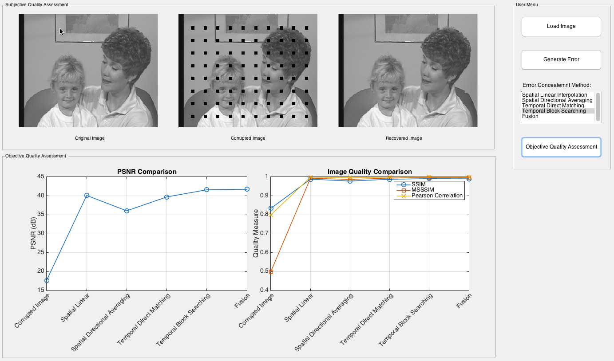

# IQA GUI tookit
A Matlab based GUI toolkit for evaluating several error concealment and image quality assessment algorithms.

[](https://vimeo.com/147613882)

## Usage
In Matlab shell, ```>> IQA_GUI```, click the buttons in the user menu.  
The example image files are extracted from the [Mother&Daughter](https://media.xiph.org/video/derf/) video sequence in CIF format provided by [Xiph.Org Foundation](https://www.xiph.org/)

## References
[1] Z. Wang, A. C. Bovik, H. R. Sheikh and E. P. Simoncelli, "Image quality assessment: From error visibility to structural similarity," IEEE Transactions on Image Processing, vol. 13, no. 4, pp. 600-612, Apr. 2004.

[2] Z. Wang, E.P. Simoncelli, and A.C. Bovik, "Multiscale structural similarity for image quality assessment," in IEEE Asilomar Conference on Signals, Systems and Computers, November 2003, vol. 2, pp. 1398–1402

[3] Kung, Wei-Ying, Chang-Su Kim, and CC Jay Kuo. "Spatial and temporal error concealment techniques for video transmission over noisy channels." Circuits and Systems for Video Technology, IEEE Transactions on 16.7 (2006): 789-803.


